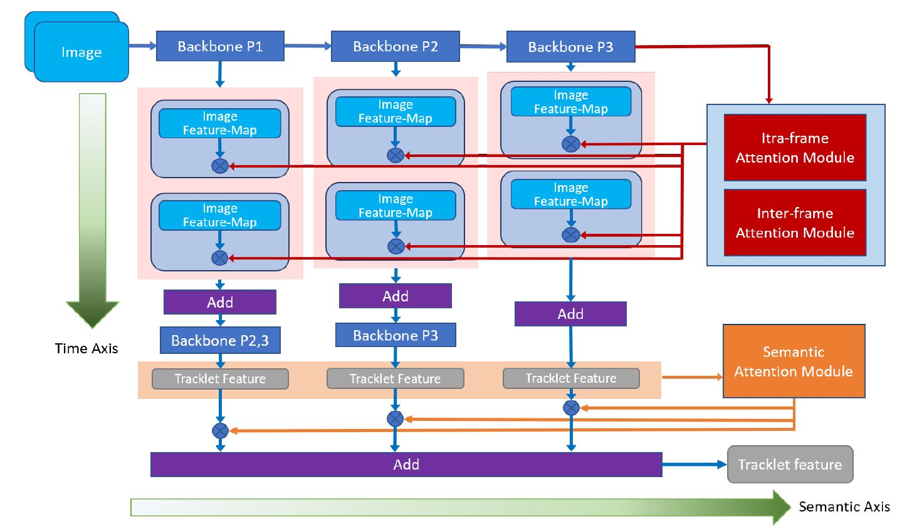

# Rethinking Temporal Fusion for Video-based Person Re-identification on Semantic and Time Aspect (AAAI 2020)
Code for AAAI 2020 paper [Rethinking Temporal Fusion for Video-based Person Re-identification on Semantic and Time Aspect](https://arxiv.org/abs/1911.12512). 
If you find this code useful in your research, please consider citing:
```
@article{jiang2020rethinking,
  title={Rethinking Temporal Fusion for Video-based Person Re-identification on Semantic and Time Aspect},
  author={Xinyang Jiang, Yifei Gong, Xiaowei Guo, Qize Yang, Feiyue Huang, Weishi Zheng, Feng Zheng, Xing Sun},
  booktitle={AAAI},
  year={2020}
}
```

## Requirements
* python 2.7
* pytorch 0.3.1
* MARS, iLIDS or other datasets.
 
## Training
### Prepare Datasets
1. File Directory:
├── partitions.pkl
├── images
│  ├── 0000000_0000_000000.png
│  ├── 0000001_0000_000001.png
│  ├── ...

2. Rename the images in following convention:
"000000_000_000000.png"
where the first substring splitted by underline is the person identity;
for the second substring, the first digit is the camera id and the rest is track id;
and the third substring is an image offset. 

3. "partitions.pkl" file
This file contains a python dictionary storing meta data of the datasets, which contains folling key value pairs
"train_im_names": [list of image names] #storing a list of names of training images
"train_ids2labels":{"identity":label} #a map that maps the person identity string to a integer label
"val_im_names": [list of image names] #storing a list of names of validation images
"test_im_names": [list of image names] #storing a list of names of testing images
"test_marks"/"val_marks": [list of 0/1] #0/1 indicates if an image is in gallery

4. Other dataset directory structure
To use other directory structure, override the data loader in "stf/Dataset/dataset.py" 

### Run Script
Start training by running script train.sh

## Testing
Start testing by runing script train.sh

## Model Framework


## Model Performance


